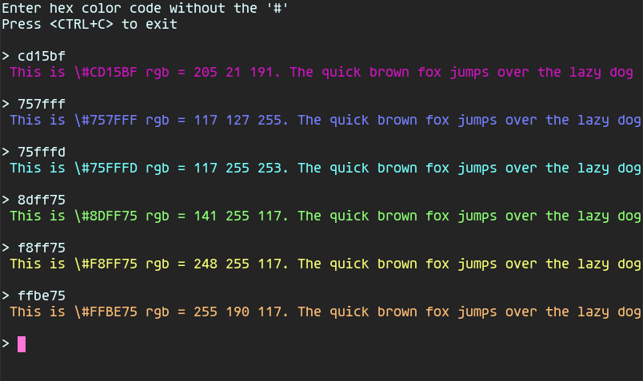

# colortest
A simple bash script to test html color codes in a terminal emulator.

Paste or type the hex color code at the prompt ommiting the '#' symbol  
Use <CTRL-C> to terminate the script.  
Colortest is useful for testing how base 16 colors are represented in your terminal.

## Screenshot

